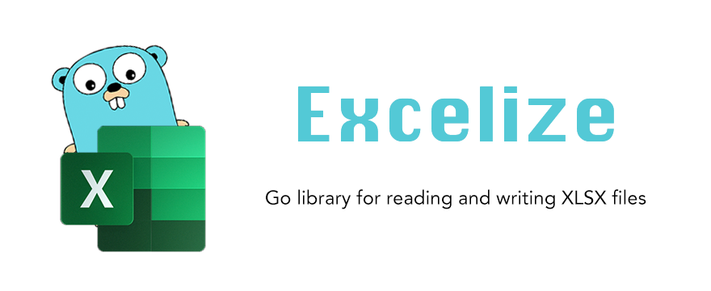

# Excelize

[](https://travis-ci.org/Luxurioust/excelize)
[](https://codecov.io/gh/Luxurioust/excelize)
[](https://goreportcard.com/report/github.com/Luxurioust/excelize)
[](https://godoc.org/github.com/Luxurioust/excelize)
[](https://opensource.org/licenses/BSD-3-Clause)
[](https://gitter.im/xuri-excelize/Lobby)

## Introduction

Excelize is a library written in pure Golang and providing a set of functions that allow you to write to and read from XLSX files. Support reads and writes XLSX file generated by Office Excel 2007 and later. Support save file without losing original charts of XLSX. The full API docs can be seen using go's built-in documentation tool, or online at [godoc.org](https://godoc.org/github.com/Luxurioust/excelize).

## Basic Usage

### Installation

```go
go get github.com/Luxurioust/excelize
```

### Create XLSX files

Here is a minimal example usage that will create XLSX file.

```go
package main

import (
    "fmt"
    "os"
    
    "github.com/Luxurioust/excelize"
)

func main() {
    xlsx, err := excelize.CreateFile()
    if err != nil {
        fmt.Println(err)
        os.Exit(1)
    }
    xlsx.NewSheet(2, "Sheet2")
    xlsx.NewSheet(3, "Sheet3")
    xlsx.SetCellInt("Sheet2", "A23", 10)
    xlsx.SetCellStr("Sheet3", "B20", "Hello")
    err = xlsx.WriteTo("/home/Workbook.xlsx")
    if err != nil {
        fmt.Println(err)
        os.Exit(1)
    }
}
```

### Writing XLSX files

The following constitutes the bare minimum required to write an XLSX document.

```go
package main

import (
    "fmt"
    "github.com/Luxurioust/excelize"
)

func main() {
    xlsx, err := excelize.OpenFile("/home/Workbook.xlsx")
    if err != nil {
        fmt.Println(err)
        os.Exit(1)
    }
    xlsx.SetCellInt("Sheet2", "B2", 100)
    xlsx.SetCellStr("Sheet2", "C11", "Hello")
    xlsx.NewSheet(3, "TestSheet")
    xlsx.SetCellInt("Sheet3", "A23", 10)
    xlsx.SetCellStr("Sheet3", "b230", "World")
    xlsx.SetActiveSheet(2)
    err = xlsx.Save()
    if err != nil {
        fmt.Println(err)
        os.Exit(1)
    }
}
```

### Reading XLSX files

```go
package main

import (
    "fmt"
    "github.com/Luxurioust/excelize"
)

func main() {
    xlsx, err := excelize.OpenFile("/home/Workbook.xlsx")
    if err != nil {
        fmt.Println(err)
        os.Exit(1)
    }
    cell := xlsx.GetCellValue("Sheet2", "D11")
    fmt.Println(cell)
}
```

## Contributing

Contributions are welcome! Open a pull request to fix a bug, or open an issue to discuss a new feature or change.

## Credits

Some struct of XML originally by [tealeg/xlsx](https://github.com/tealeg/xlsx).

## Licenses

This program is under the terms of the BSD 3-Clause License. See [https://opensource.org/licenses/BSD-3-Clause](https://opensource.org/licenses/BSD-3-Clause).
